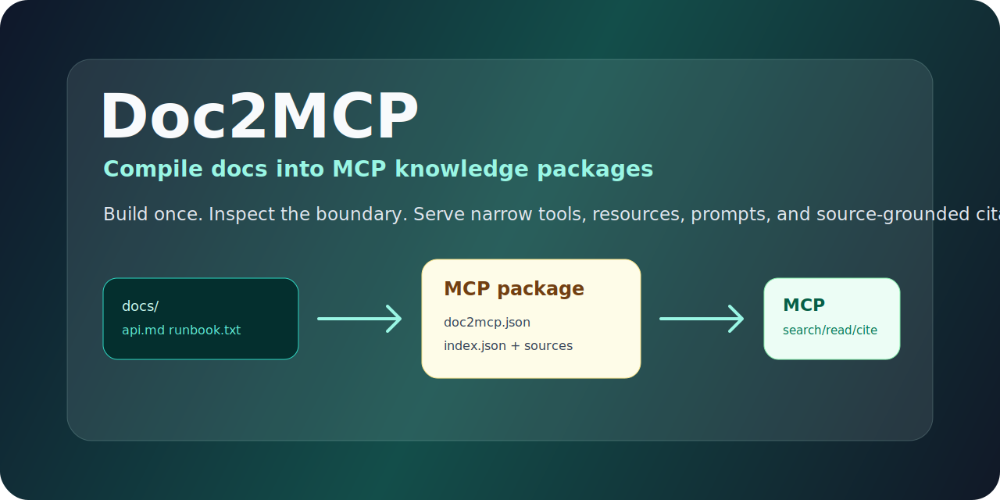
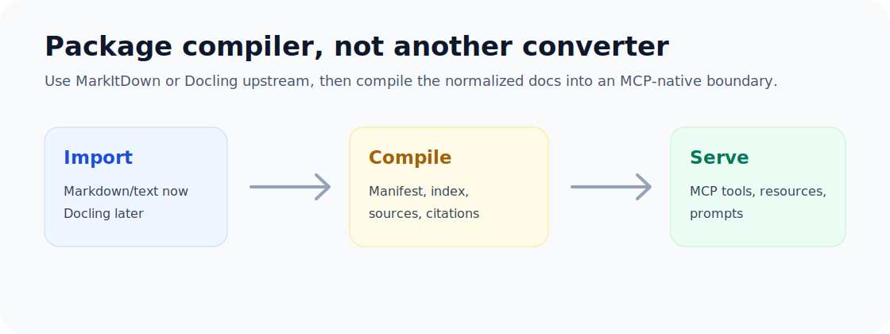

<div align="center">

# Doc2MCP

**Compile docs once. Serve them as a narrow, citation-ready MCP knowledge package.**



[](https://github.com/wayyoungboy/doc2mcp/actions/workflows/ci.yml)
[](https://pkg.go.dev/github.com/wayyoungboy/doc2mcp)
[](LICENSE)
[](docs/THREAT_MODEL.md)

</div>

Doc2MCP is not another document-to-Markdown converter. Use MarkItDown or Docling as importers when you need broad file conversion. Doc2MCP starts after normalization: it builds a reproducible package with source files, section IDs, checksums, citations, resources, tools, and prompts.

```bash
doc2mcp build ./docs --out ./dist/my-docs --name my-docs
doc2mcp search ./dist/my-docs "authentication token"
doc2mcp serve ./dist/my-docs
```

## What You Get

| Output | Why it matters |
|---|---|
| `doc2mcp.json` | Package manifest with source metadata, checksums, documents, and sections. |
| `index.json` | Flattened local index for simple CLI and MCP search. |
| `sources/` | Original imported files kept for audit and provenance. |
| MCP tools | `search_docs`, `read_doc`, and `cite_source` for agent workflows. |
| MCP prompt | `answer_with_citations` to steer answers toward source-backed responses. |



## Why

RAG servers usually ingest files at runtime and expose a search tool. That works, but it can leave agents with a fuzzy boundary over the local filesystem.

Doc2MCP uses a build step:

- compile docs once
- inspect the generated package
- expose a narrow MCP surface
- cite source sections by stable ID
- avoid surprise filesystem crawling during chat

## Features

- Markdown and plain text directory importer
- Reproducible package files: `doc2mcp.json`, `index.json`, `sources/`
- Source-grounded citations with path, heading, checksum, and section ID
- CLI search and section display
- stdio MCP server
- MCP tools: `search_docs`, `read_doc`, `cite_source`
- MCP resources for compiled documents
- MCP prompt: `answer_with_citations`
- Standard-library Go implementation

## Install

```bash
go install github.com/wayyoungboy/doc2mcp/cmd/doc2mcp@latest
```

Local checkout:

```bash
git clone https://github.com/wayyoungboy/doc2mcp.git
cd doc2mcp
go test ./...
go run ./cmd/doc2mcp build testdata/docs --out /tmp/doc2mcp-demo --name demo-docs
```

## Commands

### Build

```bash
doc2mcp build ./docs --out ./dist/product-docs --name product-docs
```

Output:

```text
dist/product-docs/
  doc2mcp.json
  index.json
  sources/
```

### Search

```bash
doc2mcp search ./dist/product-docs "rate limit retry"
doc2mcp search ./dist/product-docs "rate limit retry" --json true
```

### Show

```bash
doc2mcp show ./dist/product-docs api.md#authentication
```

### Serve MCP

```json
{
  "mcpServers": {
    "product-docs": {
      "command": "doc2mcp",
      "args": ["serve", "/absolute/path/to/dist/product-docs"]
    }
  }
}
```

### Claude Code and Codex

Doc2MCP can be launched by both Claude Code and Codex as a local stdio MCP server.

- Claude Code: use a project `.mcp.json` or `claude mcp add product-docs --scope project -- doc2mcp serve /absolute/path/to/dist/product-docs`
- Codex: add `[mcp_servers.product-docs]` to `~/.codex/config.toml`

See [Agent Integrations](docs/agent-integrations.md) and the sample files in `examples/`.

## Positioning

| Tool class | Good at | Doc2MCP wedge |
|---|---|---|
| MarkItDown MCP | broad file-to-Markdown conversion | use it upstream, then compile MCP-native packages |
| Docling MCP | rich parsing, OCR, document structure | use it upstream, then freeze provenance and MCP tools |
| Local RAG MCP | runtime ingest/chunk/embed/search | build-time package boundary with resources, prompts, citations |
| Filesystem MCP | raw file access | no surprise crawl; agent sees compiled package only |

## Package Format

`doc2mcp.json` contains package metadata, documents, sections, and checksums. `index.json` contains flattened sections for simple retrieval. `sources/` keeps the original imported files for audit.

The v0.1 index is lexical and offline. v0.2 can add seekdb vector/full-text indexing without changing the package boundary.

## Status

v0.1 is an MVP. It is useful for Markdown/text docs, internal runbooks, API docs, and small knowledge packages. For PDFs, DOCX, PPTX, images, or audio, convert them with MarkItDown or Docling first, then compile the generated Markdown with Doc2MCP.
